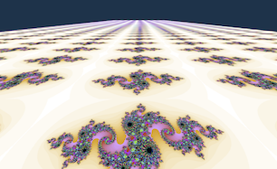

# wgpu-rs
[](https://github.com/gfx-rs/wgpu-rs/actions)
[](https://crates.io/crates/wgpu)
[](https://docs.rs/wgpu)
[](https://matrix.to/#/#wgpu:matrix.org)

wgpu-rs is an idiomatic Rust wrapper over [wgpu-core](https://github.com/gfx-rs/wgpu). It's designed to be suitable for general purpose graphics and computation needs of Rust community.

Currently wgpu-rs works on native platforms, but [WASM support is currently being added](https://github.com/gfx-rs/wgpu-rs/issues/101) as well.

## Gallery

   
  

## Usage

### How to Run Examples

All examples are located under the [examples](examples) directory.

These examples use the default syntax for running examples, as found in the [Cargo](https://doc.rust-lang.org/cargo/reference/manifest.html#examples) documentation. For example, to run the `cube` example:

```bash
cargo run --example cube
```

The `hello-triangle` and `hello-compute` examples show bare-bones setup without any helper code. For `hello-compute`, pass 4 numbers separated by spaces as arguments:

```bash
cargo run --example hello-compute 1 2 3 4
```

## Friends

Shout out to the following projects that work best with wgpu-rs:

- [wgpu_glyph](https://github.com/hecrj/wgpu_glyph) - for your text-y rendering needs
- [coffee](https://github.com/hecrj/coffee) - a whole 2D engine
- [iced](https://github.com/hecrj/iced) - a cross-platform GUI library
- [rgx](https://github.com/cloudhead/rgx) - a 2D graphics library
- [imgui-wgpu](https://github.com/Yatekii/imgui-wgpu-rs) - Dear ImGui interfacing
- [pixels](https://github.com/parasyte/pixels) - the easiest way to create a hardware-accelerated pixel frame buffer
- [kas](https://github.com/dhardy/kas) - tooKit Abstraction System
- [oxidator](https://github.com/Ruddle/oxidator) - RTS game engine
- [nannou](https://github.com/nannou-org/nannou) - a creative coding framework

Also, libraries that have support for wgpu-rs:

- [conrod](https://github.com/PistonDevelopers/conrod) - shader-based UI
- [grr-2d](https://github.com/norse-rs/grr-2d) - experimental 2D renderer
- [lyon](https://github.com/nical/lyon) - a path tessellation library

## Development

If you need to test local fixes to gfx-rs or other dependencies, the simplest way is to add a Cargo patch. For example, when working on DX12 backend on Windows, you can check out the "hal-0.2" branch of gfx-rs repo and add this to the end of "Cargo.toml":

```toml
[patch.crates-io]
gfx-backend-dx12 = { path = "../gfx/src/backend/dx12" }
gfx-hal = { path = "../gfx/src/hal" }
```

If a version needs to be changed, you need to to do `cargo update -p gfx-backend-dx12`.
