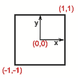
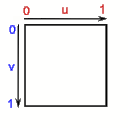

# wgpu

[](https://matrix.to/#/#Wgpu:matrix.org)
[](https://matrix.to/#/#wgpu:matrix.org)
[](https://matrix.to/#/#wgpu-users:matrix.org)
[](https://github.com/gfx-rs/wgpu/actions)
[](https://codecov.io/gh/gfx-rs/wgpu)

`wgpu` is a cross-platform, safe, pure-rust graphics API. It runs natively on Vulkan, Metal, D3D12, and OpenGL; and on top of WebGL2 and WebGPU on wasm.

The API is based on the [WebGPU standard](https://gpuweb.github.io/gpuweb/). It serves as the core of the WebGPU integration in Firefox and Deno.

## Repo Overview

The repository hosts the following libraries:

- [](https://crates.io/crates/wgpu) [](https://docs.rs/wgpu/) - User facing Rust API.
- [](https://crates.io/crates/wgpu-core) [](https://docs.rs/wgpu-core/) - Internal safe implementation.
- [](https://crates.io/crates/wgpu-hal) [](https://docs.rs/wgpu-hal/) - Internal unsafe GPU API abstraction layer.
- [](https://crates.io/crates/wgpu-types) [](https://docs.rs/wgpu-types/) - Rust types shared between all crates.
- [](https://crates.io/crates/naga) [](https://docs.rs/naga/) - Stand-alone shader translation library.
- [](https://crates.io/crates/d3d12) [](https://docs.rs/d3d12/) - Collection of thin abstractions over d3d12.
- [](https://crates.io/crates/deno_webgpu) - WebGPU implementation for the Deno JavaScript/TypeScript runtime

The following binaries:

- [](https://crates.io/crates/naga-cli) - Tool for translating shaders between different languages using `naga`.
- [](https://crates.io/crates/wgpu-info) - Tool for getting information on GPUs in the system.
- `cts_runner` - WebGPU Conformance Test Suite runner using `deno_webgpu`.
- `player` - standalone application for replaying the API traces.

For an overview of all the components in the gfx-rs ecosystem, see [the big picture](./etc/big-picture.png).

## Getting Started

### Rust

Rust examples can be found at [wgpu/examples](examples). You can run the examples on native with `cargo run --bin wgpu-examples <example>`. See the [list of examples](examples).

To run the examples in a browser, run `cargo xtask run-wasm`.
Then open `http://localhost:8000` in your browser, and you can choose an example to run.
Naturally, in order to display any of the WebGPU based examples, you need to make sure your browser supports it.

If you are looking for a wgpu tutorial, look at the following:

- https://sotrh.github.io/learn-wgpu/

### C/C++

To use wgpu in C/C++, you need [wgpu-native](https://github.com/gfx-rs/wgpu-native).

If you are looking for a wgpu C++ tutorial, look at the following:

- https://eliemichel.github.io/LearnWebGPU/

### Others

If you want to use wgpu in other languages, there are many bindings to wgpu-native from languages such as Python, D, Julia, Kotlin, and more. See [the list](https://github.com/gfx-rs/wgpu-native#bindings).

## Community

We have the Matrix space [](https://matrix.to/#/#Wgpu:matrix.org) with a few different rooms that form the wgpu community:

- [](https://matrix.to/#/#wgpu:matrix.org) - discussion of the wgpu's development.
- [](https://matrix.to/#/#naga:matrix.org) - discussion of the naga's development.
- [](https://matrix.to/#/#wgpu-users:matrix.org) - discussion of using the library and the surrounding ecosystem.
- [](https://matrix.to/#/#wgpu-random:matrix.org) - discussion of everything else.

## Wiki

We have a [wiki](https://github.com/gfx-rs/wgpu/wiki) that serves as a knowledge base.

## Supported Platforms

| API    | Windows            | Linux/Android      | macOS/iOS          | Web (wasm)         |
| ------ | ------------------ | ------------------ | ------------------ | ------------------ |
| Vulkan |         ✅         |         ✅         |         🌋         |                    |
| Metal  |                    |                    |         ✅         |                    |
| DX12   |         ✅         |                    |                    |                    |
| OpenGL |    🆗 (GL 3.3+)    |  🆗 (GL ES 3.0+)   |         📐         |    🆗 (WebGL2)     |
| WebGPU |                    |                    |                    |         ✅         |

✅ = First Class Support  
🆗 = Downlevel/Best Effort Support  
📐 = Requires the [ANGLE](#angle) translation layer (GL ES 3.0 only)  
🌋 = Requires the [MoltenVK](https://vulkan.lunarg.com/sdk/home#mac) translation layer  
🛠️ = Unsupported, though open to contributions

### Shader Support

wgpu supports shaders in [WGSL](https://gpuweb.github.io/gpuweb/wgsl/), SPIR-V, and GLSL.
Both [HLSL](https://github.com/Microsoft/DirectXShaderCompiler) and [GLSL](https://github.com/KhronosGroup/glslang)
have compilers to target SPIR-V. All of these shader languages can be used with any backend as we handle all of the conversions. Additionally, support for these shader inputs is not going away.

While WebGPU does not support any shading language other than WGSL, we will automatically convert your
non-WGSL shaders if you're running on WebGPU.

WGSL is always supported by default, but GLSL and SPIR-V need features enabled to compile in support.

Note that the WGSL specification is still under development,
so the [draft specification][wgsl spec] does not exactly describe what `wgpu` supports.
See [below](#tracking-the-webgpu-and-wgsl-draft-specifications) for details.

To enable SPIR-V shaders, enable the `spirv` feature of wgpu.
To enable GLSL shaders, enable the `glsl` feature of wgpu.

### Angle

[Angle](http://angleproject.org) is a translation layer from GLES to other backends developed by Google.
We support running our GLES3 backend over it in order to reach platforms DX11 support, which aren't accessible otherwise.
In order to run with Angle, the "angle" feature has to be enabled, and Angle libraries placed in a location visible to the application.
These binaries can be downloaded from [gfbuild-angle](https://github.com/DileSoft/gfbuild-angle) artifacts, [manual compilation](https://github.com/google/angle/blob/main/doc/DevSetup.md) may be required on Macs with Apple silicon.

On Windows, you generally need to copy them into the working directory, in the same directory as the executable, or somewhere in your path.
On Linux, you can point to them using `LD_LIBRARY_PATH` environment.

### MSRV policy

Due to complex dependants, we have two MSRV policies:

- `d3d12`, `naga`, `wgpu-core`, `wgpu-hal`, and `wgpu-types`'s MSRV is **1.74**.
- The rest of the workspace has an MSRV of **1.76**.

It is enforced on CI (in "/.github/workflows/ci.yml") with the `CORE_MSRV` and `REPO_MSRV` variables.
This version can only be upgraded in breaking releases, though we release a breaking version every three months.

The `naga`, `wgpu-core`, `wgpu-hal`, and `wgpu-types` crates should never
require an MSRV ahead of Firefox's MSRV for nightly builds, as
determined by the value of `MINIMUM_RUST_VERSION` in
[`python/mozboot/mozboot/util.py`][util].

[util]: https://searchfox.org/mozilla-central/source/python/mozboot/mozboot/util.py

## Environment Variables

All testing and example infrastructure share the same set of environment variables that determine which Backend/GPU it will run on.

- `WGPU_ADAPTER_NAME` with a substring of the name of the adapter you want to use (ex. `1080` will match `NVIDIA GeForce 1080ti`).
- `WGPU_BACKEND` with a comma-separated list of the backends you want to use (`vulkan`, `metal`, `dx12`, or `gl`).
- `WGPU_POWER_PREF` with the power preference to choose when a specific adapter name isn't specified (`high`, `low` or `none`)
- `WGPU_DX12_COMPILER` with the DX12 shader compiler you wish to use (`dxc` or `fxc`, note that `dxc` requires `dxil.dll` and `dxcompiler.dll` to be in the working directory otherwise it will fall back to `fxc`)
- `WGPU_GLES_MINOR_VERSION` with the minor OpenGL ES 3 version number to request (`0`, `1`, `2` or `automatic`).
- `WGPU_ALLOW_UNDERLYING_NONCOMPLIANT_ADAPTER` with a boolean whether non-compliant drivers are enumerated (`0` for false, `1` for true).

When running the CTS, use the variables `DENO_WEBGPU_ADAPTER_NAME`, `DENO_WEBGPU_BACKEND`, `DENO_WEBGPU_POWER_PREFERENCE`.

## Testing

We have multiple methods of testing, each of which tests different qualities about wgpu. We automatically run our tests on CI. The current state of CI testing:

| Platform/Backend | Tests              | Notes                 |
| ---------------- | ------------------ | --------------------- |
| Windows/DX12     | :heavy_check_mark: | using WARP            |
| Windows/OpenGL   | :heavy_check_mark: | using llvmpipe        |
| MacOS/Metal      | :heavy_check_mark: | using hardware runner |
| Linux/Vulkan     | :heavy_check_mark: | using lavapipe        |
| Linux/OpenGL ES  | :heavy_check_mark: | using llvmpipe        |
| Chrome/WebGL     | :heavy_check_mark: | using swiftshader     |
| Chrome/WebGPU    | :x:                | not set up            |

### Core Test Infrastructure

We use a tool called [`cargo nextest`](https://github.com/nextest-rs/nextest) to run our tests.
To install it, run `cargo install cargo-nextest`.

To run the test suite:

```
cargo xtask test
```

To run the test suite on WebGL (currently incomplete):

```
cd wgpu
wasm-pack test --headless --chrome --no-default-features --features webgl --workspace
```

This will automatically run the tests using a packaged browser. Remove `--headless` to run the tests with whatever browser you wish at `http://localhost:8000`.

If you are a user and want a way to help contribute to wgpu, we always need more help writing test cases.

### WebGPU Conformance Test Suite

WebGPU includes a Conformance Test Suite to validate that implementations are working correctly. We can run this CTS against wgpu.

To run the CTS, first, you need to check it out:

```
git clone https://github.com/gpuweb/cts.git
cd cts
# works in bash and powershell
git checkout $(cat ../cts_runner/revision.txt)
```

To run a given set of tests:

```
# Must be inside the `cts` folder we just checked out, else this will fail
cargo run --manifest-path ../Cargo.toml -p cts_runner --bin cts_runner -- ./tools/run_deno --verbose "<test string>"
```

To find the full list of tests, go to the [online cts viewer](https://gpuweb.github.io/cts/standalone/?runnow=0&worker=0&debug=0&q=webgpu:*).

The list of currently enabled CTS tests can be found [here](./cts_runner/test.lst).

## Tracking the WebGPU and WGSL draft specifications

The `wgpu` crate is meant to be an idiomatic Rust translation of the [WebGPU API][webgpu spec].
That specification, along with its shading language, [WGSL][wgsl spec],
are both still in the "Working Draft" phase,
and while the general outlines are stable,
details change frequently.
Until the specification is stabilized, the `wgpu` crate and the version of WGSL it implements
will likely differ from what is specified,
as the implementation catches up.

Exactly which WGSL features `wgpu` supports depends on how you are using it:

- When running as native code, `wgpu` uses the [Naga][naga] crate
  to translate WGSL code into the shading language of your platform's native GPU API.
  Naga has [a milestone][naga wgsl milestone]
  for catching up to the WGSL specification,
  but in general, there is no up-to-date summary
  of the differences between Naga and the WGSL spec.

- When running in a web browser (by compilation to WebAssembly)
  without the `"webgl"` feature enabled,
  `wgpu` relies on the browser's own WebGPU implementation.
  WGSL shaders are simply passed through to the browser,
  so that determines which WGSL features you can use.

- When running in a web browser with `wgpu`'s `"webgl"` feature enabled,
  `wgpu` uses Naga to translate WGSL programs into GLSL.
  This uses the same version of Naga as if you were running `wgpu` as native code.

[webgpu spec]: https://www.w3.org/TR/webgpu/
[wgsl spec]: https://gpuweb.github.io/gpuweb/wgsl/
[naga]: https://github.com/gfx-rs/naga/
[naga wgsl milestone]: https://github.com/gfx-rs/naga/milestone/4

## Coordinate Systems

wgpu uses the coordinate systems of D3D and Metal:

| Render                                              | Texture                                               |
| --------------------------------------------------- | ----------------------------------------------------- |
|  |  |
