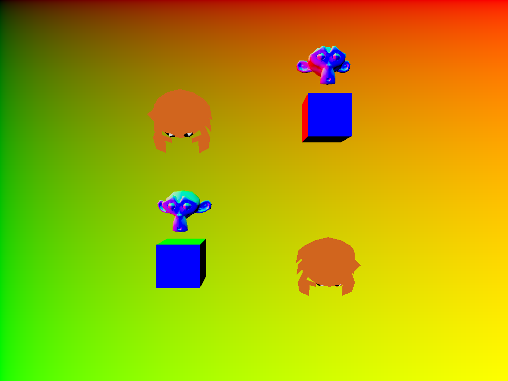

# ray_scene

This example ray traces a scene loaded from an `.obj` model, with hardware
acceleration. It builds a bottom-level acceleration structure per mesh and a
top-level structure for the instances, then colors the hit surface with the
model's materials.

## To Run

```
cargo run --bin wgpu-examples ray_scene
```

## Screenshots


