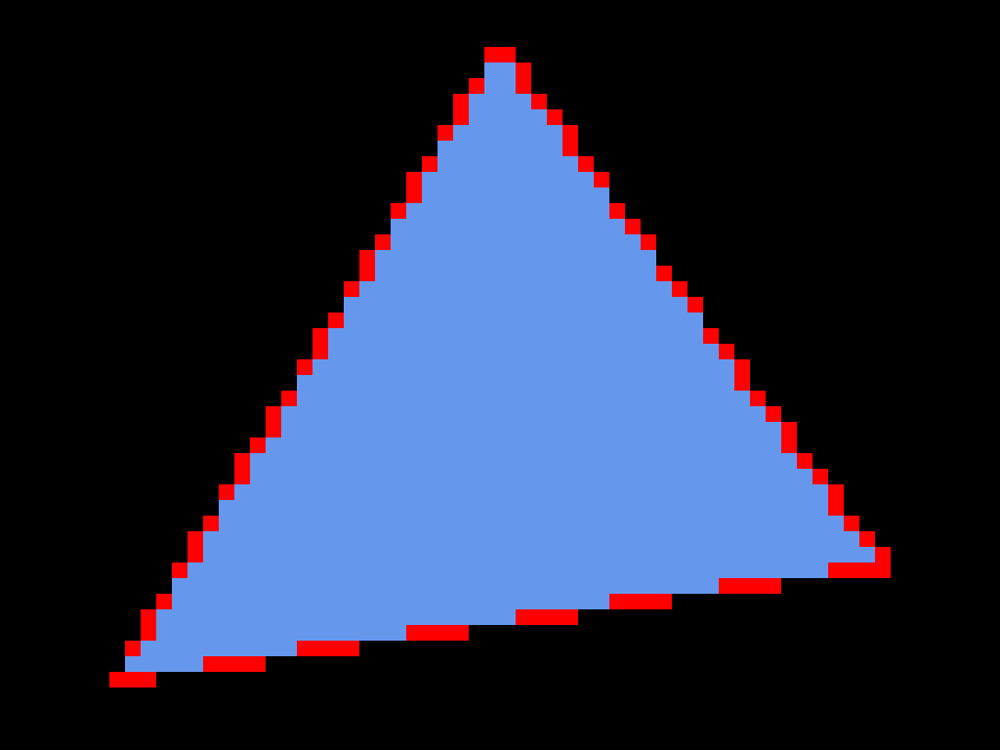

# conservative_raster

This example shows how to render with conservative rasterization (native extension with limited support).

When enabled, any pixel touched by a triangle primitive is rasterized.
This is useful for various advanced techniques, most prominently for implementing realtime voxelization.

The demonstration here is implemented by rendering a triangle to a low-resolution target and then upscaling it with nearest-neighbor filtering.
The outlines of the triangle are then rendered in the original solution, using the same vertex shader as the triangle.
Pixels only drawn with conservative rasterization enabled are depicted red.

## To Run

```
cargo run --bin wgpu-examples conservative_raster
```

## Screenshots


