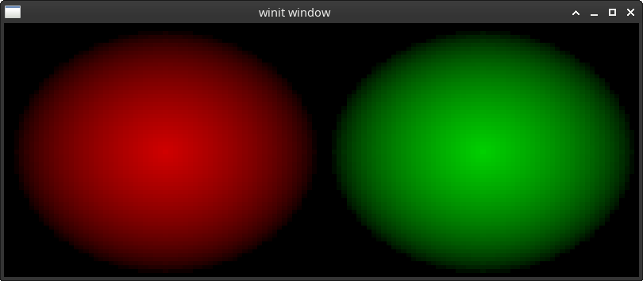

# multiple_render_targets

This example demonstrates how to use fragment shader to output to two color attachments of a renderpass simultaneously. 

The program generates a black and white ball-shaped texture from scratch and uses the fragment shader to draw it to two
separate texture targets. The first texture target receives a red version of the texture and the second target receives
a green version. 

Once the colored shapes have been drawn to two separate textures, they
will be displayed on the screen by rendering each one of them to their own viewports that split the screen in half.


## To Run

```
cargo run --bin wgpu-examples multiple_render_targets
```

## Screenshots


