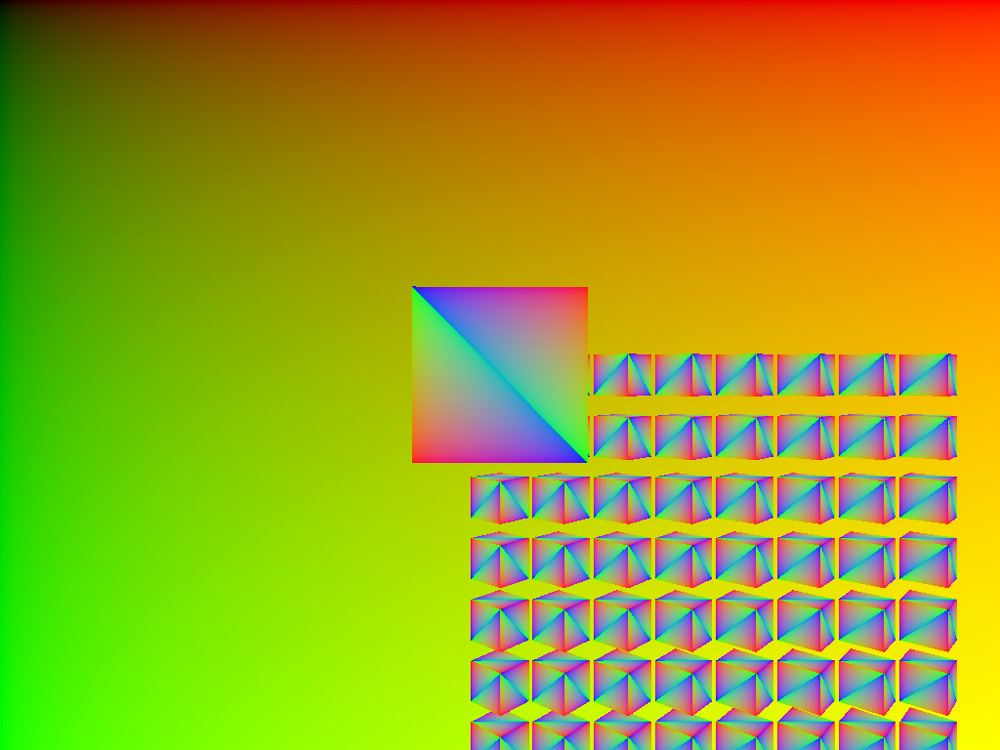

# ray-cube

This example renders a ray traced cube with hardware acceleration.
A separate compute shader is used to perform the ray queries. 

## To Run

```
cargo run --bin wgpu-examples ray_cube_compute
```

## Screenshots


