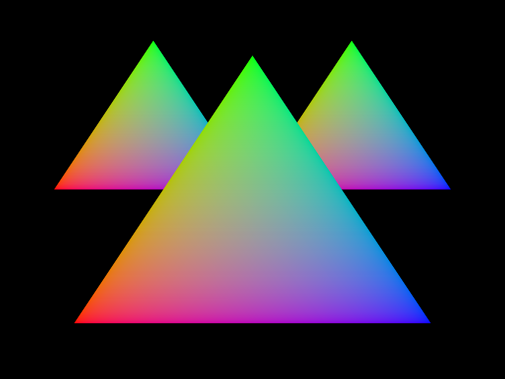

# ray-traced-triangle

This example renders three triangles with hardware acceleration.
This is the same scene set-up as hal ray-traced triangle

## To Run

```
cargo run --bin wgpu-examples ray_traced_triangle
```

## Screenshots


