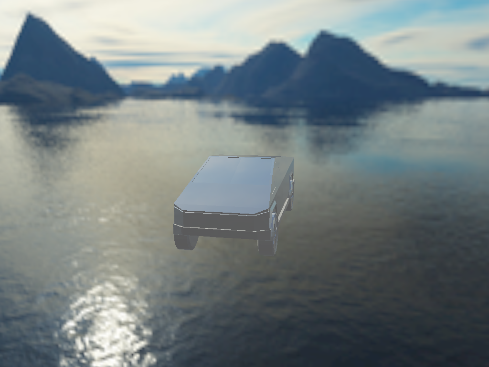

# skybox

This animated example demonstrates loading a Wavefront OBJ model, and rendering it with skybox and simple reflections.
It hooks up `winit` mouse controls for camera rotation around the model at the center.

## To Run

```
cargo run --bin wgpu-examples skybox
```

## Screenshots


