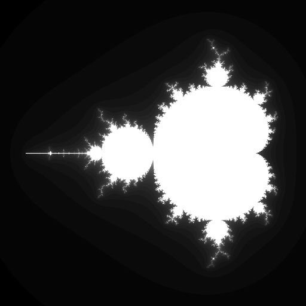

# storage_texture

A simple example that uses a storage texture to compute an image of the Mandelbrot set (https://en.wikipedia.org/wiki/Mandelbrot_set) and either saves it as an image or presents it to the browser screen in such a way that it can be saved as an image.

## To Run

```
cargo run --bin wgpu-examples storage_texture
```


## Example Output

