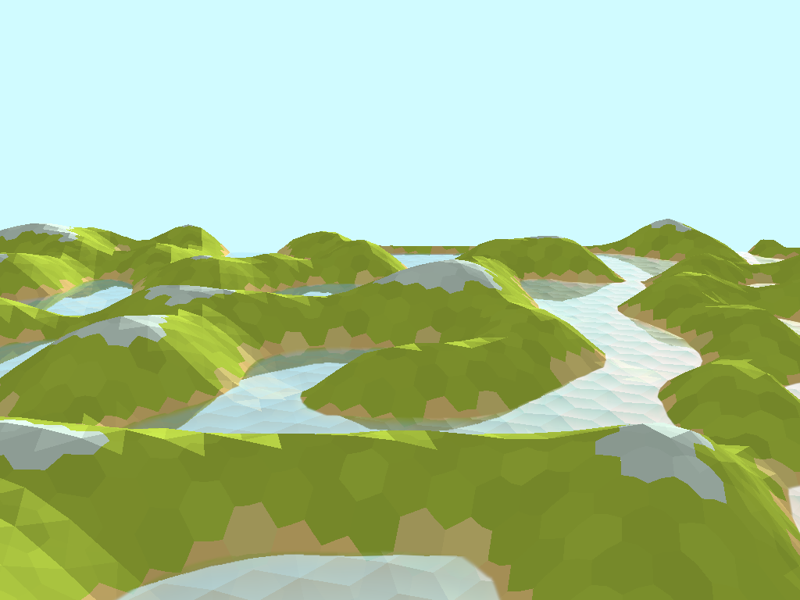

# Water example

This example renders animated water.

It demonstrates Read only Depth/Stencil (abbreviated RODS), where a depth/stencil buffer is used as an attachment which is read-only. In this case it's used in the shaders to calculate reflections and depth.

## Files:

```
water
├── main.rs ------------------ Main program
├── point_gen.rs ------------- Hexagon point generation
├── README.md ---------------- This readme
├── screenshot.png ----------- Screenshot
├── terrain.wgsl ------------- WGSL Shader for terrain
└── water.wgsl --------------- WGSL Shader for water
```

## To run

```
cargo run --bin wgpu-examples water
```

## Screenshot


