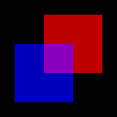

# cube

This example shows blending in sRGB or linear space.

## To Run

```
cargo run --bin cube -- linear
```

```
cargo run --bin cube
```

## Screenshots

Blending in linear space:



Blending in sRGB space:


