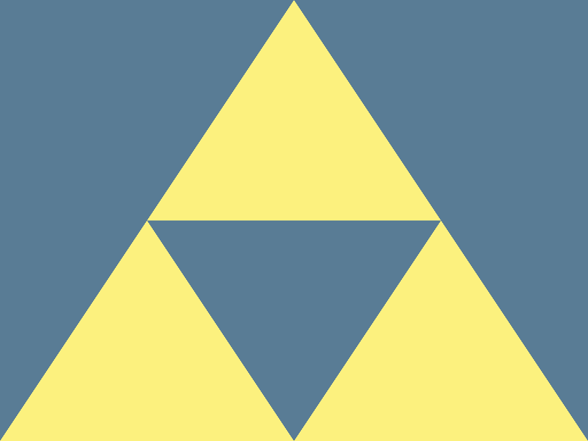

# hello-triangle

This example renders two different sized triangles to display three same sized triangles,
by demonstrating the use of stencil buffers.

First it draws a small "mask" triangle, which sets the stencil buffer at every pixel to 1.

Then, it draws a larger "outer" triangle which only touches pixels where the stencil buffer is less than 1.

## To Run

```
cargo run --bin stencil-triangles
```

## Screenshots


