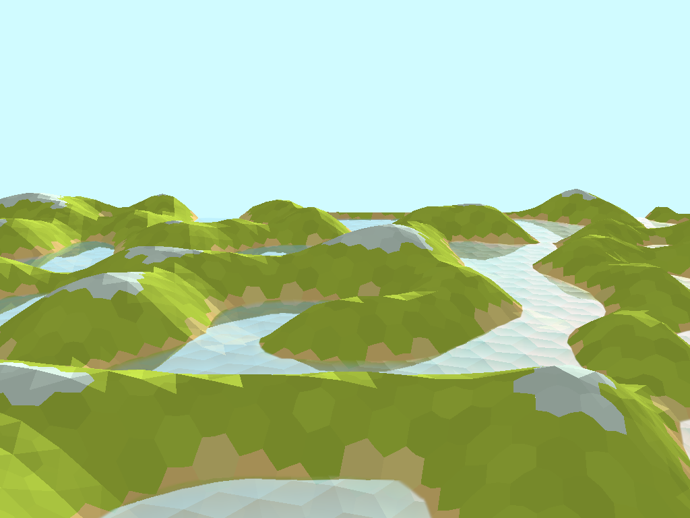

# Water example

This example renders animated water.

It demonstrates Read only Depth/Stencil (abbreviated RODS), where a depth/stencil buffer is used as an attachment which is read-only. In this case it's used in the shaders to calculate reflections and depth.

## Files:
```
water
├── main.rs ------------------ Main program
├── point_gen.rs ------------- Hexagon point generation
├── README.md ---------------- This readme
├── screenshot.png ----------- Screenshot
├── terrain_shader.frag ------ Terrain fragment shader
├── terrain_shader.frag.spv -- Compiled terrain fragment shader
├── terrain_shader.vert ------ Terrain vertex shader
├── terrain_shader.vert.spv -- Compiled terrain vertex shader
├── water_shader.frag -------- Water fragment shader
├── water_shader.frag.spv ---- Compiled water fragment shader
├── water_shader.vert -------- Water vertex shader
└── water_shader.vert.spv ---- Compiled water vertex shader
```

## To run
```
cargo run --example water
```
## To recompile shaders 
(requires make and `glslangvalidator`)
```
make
```
## Screenshot

